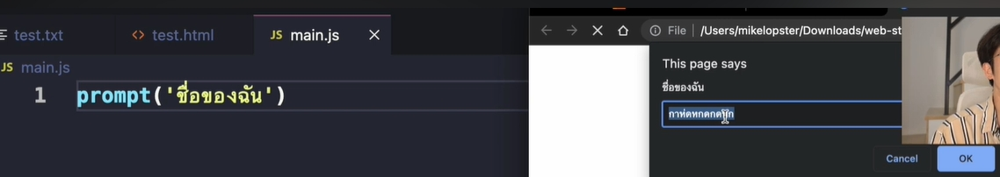
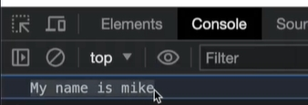

# Reference From
Document from: [Doc](https://docs.mikelopster.dev/c/web101/chapter-5/intro)<br>
Document from: [Doc2](https://www.w3schools.com/js/default.asp)<br>
Document from: [Mikelopster](https://www.youtube.com/watch?v=XQdyV_x4UKA&list=PLwZ0y9k-cYXCSSU3ujBqBWMbtZcW2OGkA&index=5)<br>

<hr>

# Basic command
## `<script>`
สำหรับใช้งาน javascript นั้นปกติจะมี 2 ตำแหน่งที่สามารถวางได้

1. การวางไว้ใน head = ให้ script run ก่อนโดยยังไม่สนใจว่าหน้าจอแสดง DOM ส่วนเนื้อหาเสร็จไหม
````html
<head>
  <script>
    console.log('Hello world')
  </script>
</head>
<body>
  <!-- comment -->
</body>
````
2. การวางไว้ใน body (เหมือนเคสตัวอย่างด้านบน) = ให้ script run หลังจาก DOM ออกมาครบแล้ว (ส่วนใหญ่จะวางไว้ตรงนี้)

   ซึ่งการจะวางที่ 1 หรือ 2 นั้นจะขึ้นอยู่กับว่า เราจะทำอะไรกับ HTML ด้วยหรือไม่ใน javascript ซึ่งส่วนใหญ่ถ้าต้องจัดการ HTML ก็มักจะวางในตำแหน่ง body เพื่อให้สามารถ access HTML element (DOM) ได้

   รวมถึง javascript เองก็สามารถแยกไฟล์และ import เข้ามาจากไฟล์ข้างนอกได้ 
  เช่น ถ้าเราสร้างไฟล์ index.js และในไฟล์มี 
  ```js
  console.log('Hello world')
  ``` 
  และที่ index.html ให้เปลี่ยน tag script เป็นการนำเข้าผ่าน src มาแทน
  ````html
  <body>
  /* comment */
  // comment
  <script src="index.js"></script>
  </body>
  ````
**ผลลัพธ์เหมือนกัน**


## `<prompt>`
นี่คือหน้าตาของ prompt<br>


## 1. variables
การประกาศตัวแปร จะขึ้นต้นด้วย
* let สำหรับตัวแปรที่สามารถเปลี่ยนค่าได้
* const สำหรับตัวแปรที่ไม่สามารถเปลี่ยนค่าได้ (ค่าคงที่)
````js
let firstname = 'mike' // ประกาศตัวแปรชื่อ firstname เก็บ string เอาไว้ชื่อ 'mike'
let isCheck = false // ประกาศตัวแปรชื่อ isCheck เก็บ boolean แบบ false

// เมื่อต้องการเปลี่ยนค่าตัวแปร ให้ประกาศชื่อตัวแปรนั้น และ assign ค่าใหม่เข้าได้เลย

isCheck = true // เปลี่ยนค่า isCheck ใหม่เป็น true
firstname = 'newmike' // เปลี่ยนค่า firstname ใหม่เป็นชื่อ newmike
````
`console.log('My name is',name)`<br>


* string

    ```js
    let firstname = 'apin' 
    ```

* number

    ```js
    let age = 20 
    ```

* bool

    ```js
    let isThai = true
    ```

* object

    วิธีประกาศ obj ธรรมดา

    ```js
    let std = {
        age: 30,
        name: 'mike',
        grade: 'A'
    }
    ```

    วิธีประกาศ obj array

    ```js
    let std = [{
        age: 30,
        name: 'mike',
        grade: 'A'
    },{
        age: 20,
        name: 'mm',
        grade: 'B'
    }]
    ```
## 2. Operator
* operator +, -, *, /, %

```js
let num1 = 'test'
let num2 = 'num'

let num3 = num1 + num2 //+ ใช้ต่อ string 
console.log('new number is', num3)
```


* condition &&, ||, ! ใช้เหมือน c++

```js
let score = prompt('input your score') //input
console.log('your score ', score)      //output

if (score >= 80) {
    console.log('GRAD : A')
} else if (score >= 50) {
    console.log('GRAD : D')
} else {
    console.log('GRAD : F')
}
```

## 3. Loop

```js
console.log('------ while  loop -----')
let count1 = 0
while (count1 < 10) {
    console.log(count1)
    count1 = count1 + 1 
}

console.log('------ for loop -----')
for (let count2= 0; count2 < 10; count2++) {
    console.log(count2)
    
}
```

## 4.Array
มี function ไว้เรียกใช้งานเช่น
* push 
* pop
* sort     เรียงจาก น้อย-> มาก
* includes เช็คว่ามีสิ่งนั้นอยู่ในลิสหรือป่าว

```js
let ages = [22,20,24]

console.log('length of list:' ,ages.length)
for (let index = 0; index < ages.length; index++) {
    console.log(ages[index])
    
}
//ใช้แบบนี้ในการเข้าถึงง่ายกว่า ถ้าจะแค่ output
console.log(ages) 

```

**ตัวอย่าง** array.push()

```js
ages.push(28)
console.log(ages) 
```

**ตัวอย่าง** ages.pop()

```js
ages.pop()
console.log(ages)
```


**ตัวอย่าง** .ages.sort

```js
console.log('----- sort -----')
console.log(ages)
ages.sort()
console.log(ages)
```

**ตัวอย่าง**  ages.includes 

```js
if (ages.includes(22)) {
    console.log('you have 22 in list')
}
```

## 5. function
function มี 3 แบบ

* function ปกติ

**ตัวอย่าง** function ปกติ

```js
function calculation(score) {
    
    if (score >= 80) {
        grade = 'A'
    } else if (score >= 50) {
        grade = 'D'
    } else {
        grade = 'F'
    }

    return grade
}

let score1 = 80
let score2 = 50

let grade1 = calculation(score1)
let grade2 = calculation(score2)

console.log('grade:', grade1 , grade2)
```
* arrow function

คือ function ปกติ ที่เอามาเขียนในรูปย่อ จะเห็นความแตกต่างและตัวอย่างการใช้งานได้ชัดเจนขึ้นในหัวข้อที่ **6.Object**

**ตัวอย่าง** arrow function

```js
let calculation = (score) => {
    
    if (score >= 80) {
        grade = 'A'
    } else if (score >= 50) {
        grade = 'D'
    } else {
        grade = 'F'
    }

    return grade
}
```

* paramiter function

คือ functon ที่มี paramitor เป็น function อีกที ในหัวข้อนี้จะแนะนำอีก 3 function ที่จะเอามาเป็นตัวอย่างการใช้ paramiter function ได้แก่

* .map( )       เข้าถึงและทำไรบางอย่างกับค่าของ obj
* .forEach( )   เข้าถึง ใช้แทน for-loop
* .filter( )    จะ คืนค่า array ใหม่ ที่มีเฉพาะสมาชิกที่ตรงตามเงื่อนไข

**ตัวอย่าง** paramiter function (.map() +.forEach( ))

```js
let score = [10,20,30,40]

for (let index = 0; index < score.length; index++) {
    console.log('score:', score[index])
    
}

//map 
score = score.map((s) => {
    return s * 2
})

//forEach
score.forEach((s) => {
    console.log('new score', s)
})
```

**ตัวอย่าง** paramiter function (.filter +.forEach( ))

```js
let score = [10,20,30,40]

for (let index = 0; index < score.length; index++) {
    console.log('score:', score[index])
    
}

let newScore = score.filter((s) =>{
    return s >= 30    //อันนีี้คือย่อของแบบล่าง ภ้า if เช็ค true false เขียนบรรทัดเดียวแบบนี้ได้
    /*if (s >= 30) {
        return true
    } else {
        return false
    }*/
})

newScore.forEach((i) => {
    console.log('new score:', i)
})
```

## 6.Object
ทวนวิธีประกาศและ การเข้าถึง attribute ด้วย .

```js
let std = {
    age: 30,
    name: 'mike',
    grade: 'A'
}

console.log(std.age) 
console.log(std.name)
console.log(std.grade)
```

ใช้การ loop เพื่อเข้าถึงหรือดู output

```js
for (let index = 0; index < std.length; index++) {
    console.log('\nstd no.', (index+1))
    console.log('name :', std[index].name)
    console.log('age  :', std[index].age)
    console.log('grade:', std[index].grade)
    
}
```

ใช้ push, pop ได้เหมือน array

```js
std.push({ 
    age:25,
    name: 'AA',
    grade: 'C'
})
```

## Function คืออะไร ?
Function คือ ชุดคำสั่งที่ทำการรวมกันเอาไว้ และให้เรียกใช้ผ่าน function ออกมาแทนได้
ตัวอย่างการประกาศ function นั้นมี 2 วิธีคือ
* function functionName() {} = ประกาศโดยให้ function นำหน้า
* const functionName = () => {} = ประกาศแบบ arrow function

โดย functionName สามารถกำหนดชื่อเองได้ (วิธีกำหนดเหมือนกำหนดชื่อตัวแปร)
สามารถจัดเรียงข้อมูลและปรับเปลี่ยนข้อมูลใหม่ได้ เช่น
* .find = เป็นคำสั่งค้นหา
* .sort = สำหรับการเรียงข้อมูลใหม่
* .map = สำหรับการวนลูปตัวแปร และ update ตัวแปรใหม่ออกมา
* .filter = สำหรับการ filter array เอาเฉพาะ condition ที่ต้องการออกมา

หาว่ามีค่านั้นๆอยู่ใน obj ไหม

**ตัวอย่าง** .find()

```js
let stds = [
    {
        name: 'mike',
        score: 80,
        grade: 'A'
    },
    {
        name: 'AA',
        score: 50,
        grade: 'D' 
    }
]
```


**ตัวอย่าง** .map()

```js
    let doubleScore = stds.map((s) => {
        s.score =  s.score * 2
        return s
    })
    console.log('double Score:', doubleScore)
```

**ตัวอย่าง** .filter ()

```js
let hightScore = stds.filter((s) => {
    if(s.score >= 60){
        return true
    }
})
console.log('hight Score:', hightScore)
```


# Javascript & Html
ห้วข้อนี้เราจะพูดถึงการที่ javascript สามารถสื่อสารกับ html (DOM) ได้ 
ปกติเราจะแบ่งไอเดียง่ายๆออกเป็น 2 แบบคือ
1. javascript access ไปยัง html (DOM)
2. html ส่ง Event ไปยัง javascript

# Select DOM มี 4 แบบ
## Idea การ select dom
การสื่อสารประเภทแรกคือ การสื่อสารจาก javascript เลือกไปยัง html โดย เราจะต้องเลือกเป้าหมาย 2 อย่างก่อนคือ
 1. เลือกใคร (html element ตัวไหน)
 2. ทำอะไร (เช่น ดึงค่าออกมา, แทนค่า)

## 1. document.getElementById("..") ใส่ id กำกับใน html เพื่อทำการดึงค่าออกมา

**step**
* ```id="firstname" ``` เข้าถึง id 
* สร้างตัวแปรมาเก็บค่าที่ select ```let firstnameDOM = document.getElementById('firstname')```
* ```firstnameDOM.value``` ใช้  ```.value``` เพื่อเข้าถึงค่าใน DOM ออกมา

*`ตัวอย่าง`* ใส่ id ใน input text firstname เพื่อทำการใช้ระบุสำหรับดึง value
````js
<input id="firstname" type="text" name="firstname" value="ทดสอบ">

... 
<script>
let firstname = document.getElementById('firstname')

// สำหรับแสดง DOM html ออกมา
console.log('firstname DOM', firstname)

// สำหรับการดึงค่า value ออกมา
console.log('firstname DOM', firstname.value)
</script>
````
## 2. document.getElementByClassname ใส่ class กำกับใน html เพื่อทำการดึงค่าออกมา

*`ตัวอย่าง`* ใส่ class กำกับไว้กับ input type checkbox 2 ตัวชื่อ "interest" แล้วดึงค่า value จาก checkbox ออกมา
````js
<input class="interest" type="checkbox" name="interest" value="หนังสือ"> หนังสือ
<input class="interest" type="checkbox" name="interest" value="กีฬา"> กีฬา

<script>
let interests = document.getElementByClassname('interests')

// สำหรับแสดง DOM html ออกมา (เป็น Array เนื่องจากมีหลายอัน)
console.log('interests', interests)

// สำหรับดึงค่า value ใน checkbox ออกมาทั้งหมด
for (let i = 0; i < interests.length; i++) {
    console.log(interests[i].value)
}

</script>
````

## 3. document.querySelector สำหรับ select ตาม CSS Selector แบบเดียวกับ CSS แต่เลือกเป็นตัวเดียว(อ่านเพิ่มเติม CSS Selector)

*`ตัวอย่าง`* ตามด้านล่าง ต้องการเลือกไปยัง element input ที่มี Attribute type=text ตัว firstname
```js
<!-- การใส่ value ใน input text = การใส่ค่า default ของกล่องนั้นเข้าไป -->
ชื่อจริง <input type="text" name="firstname" value="ชื่อ"> <br>
...
<script>
let inputText = document.querySelector('input[type=text]')

// ดึงค่า value จาก inputText
console.log('input value', inputText.value)
</script>
```
## 4. document.querySelectorAll สำหรับ select ตาม CSS Selector แบบเดียวกับ CSS แต่เลือกเป็นหลายตัวได้ (อ่านเพิ่มเติม CSS Selector)

*`ตัวอย่าง`* ตามด้านล่าง ต้องการเลือกไปยัง element input type=radio ทั้ง 3 ตัว โดยที่ดึง value ออกมาแสดง
```js
<input type="radio" name="gender" value="ชาย"> ชาย
<input type="radio" name="gender" value="หญิง"> หญิง
<input type="radio" name="gender" value="ไม่ระบุ"> ไม่ระบุ

...

<script>
let inputsRadio = document.querySelectorAll('input[type=radio]')

// inputsRadio ได้ออกมาเป็น Array ต้อง loop แสดงค่า value
for (let i = 0; i < inputsRadio.length; i++) {
    console.log('input value', inputsRadio[i].value)
}
</script>
```

# Javascript Event
Event คือสิ่งที่เกิดขึ้นบนเว็บไซต์ซึ่งเกิดอาจจะเกิดจากเหตุการณ์บน browser (เช่น โหลดเว็บเสร็จ, resize หน้าจอ) หรือ เหตุการณ์จาก user เช่น
* เมื่อคลิกที่ปุ่มแล้วเกิดอะไรขึ้น (onclick)
* เมื่อ user กำลังเปลี่ยนของใน radio (onchange)
* เมื่อ user กำลังพิมพ์ที่กล่องข้อความให้เกิดอะไรขึ้น (onkeydown)
* เมื่อ user เอาเมาส์วางบนข้อความเกิดอะไรขึ้น (onmouseover)

## 1. onclick 
* การดักจับ event เมื่อ user มีการคลิกที่ element ใน html

*`ตัวอย่าง`* เพิ่ม onclick ให้กับ button เมื่อ button โดนกดโดย user จะแสดงข้อความออกมาตรง console.log

**step**
1. ใส่ ``` onclick="userClick()"``` ใน DOM ที่ต้องการดัก
2. ไปสร้าง function ที่ js ให้ชื่อเหมือนกัน ```userClick()```

```html
    <button onclick="userClick()">ทดลองกด</button>
    
    <script>
        // สร้าง function สำหรับการรับ Event ชื่อ userClick และ function นี้จะถูกเรียกเมื่อ onclick ทำงาน
        function userClick() {
            console.log('user clicked')//แสดงที่คอนโซล
        }
    </script>
```

## 2. onchange
* การดักจับเมื่อ input มีการเปลี่ยนแปลงค่า (ปกติใช้ได้กับ input อย่าง text, radio, checkbox)
*  radio ต้องใช้ name เดียวกันไม่งั้นจะเลือกได้ > 1


*`ตัวอย่าง`* เพิ่ม onchange ให้กับ radio เพศ โดยเมื่อเปลี่ยนเพศให้แสดงเพศที่เปลี่ยนออกมา (เราจะใช้ร่วมกับ querySelector ก่อนหน้านี้)

```html
    <input type="radio" name="gender" value="male" onchange="changeGender()"> male
    <input type="radio" name="gender" value="female" onchange="changeGender()"> female

    <script>
        function changeGender() {
            let genderInputs = document.querySelectorAll('input[name=gender]')
            let gender = ''

            //ใช้ for เพื่อวนเข้าถึงข้อมูล เพราะ querySelectorAll จะได้ของออกมาเป็น array
            for (let index = 0; index < genderInputs.length; index++) {
                //if check ว่าใครถูกติ้ก ถ้าถูกติ้ก ก็จะเอาไปเก็บที่ gender
                if (genderInputs[index].checked) {
                    gender = genderInputs[index].value
                } 
            }

            console.log('selected gender', gender) //ดูค่า
        }
    </script>
```

## 3. onkeydown, onkeyup, onkeypress
* onkeydown = เมื่อ user กดลงบน keyboard (จังหวะกด)
* onkeyup = เมื่อ user กดปล่อยมือจากปุ่ม keyboard (จังหวะปล่อยหลังกด) จะได้ค่าที่อัปเดทแล้ว
* onkeypress = จังหวะที่ตัวอักษรถูกส่งออกมา (เกิดหลัง onkeydown, เกิดก่อน onkeyup)

*`ตัวอย่าง`* การใช้ 

```html
<body>
    first name <input type="text" name="firstname" onkeyup="changeFirstname()">
    <script>
        function changeFirstname() {
            //เข้าถึง input firstname
            let firstNameDom = document.querySelector('input[name = firstname]')
            //เอาค่า firstname ออกมา
            console.log('change first name:', firstNameDom.value)
        }
    </script>
</body>
```

## 4. onmouseover, onmouseup, onmousedown 
การดักจับเมื่อ uesr เอาเมาส์ไปวางที่ element html นั้นๆ

* onmouseover เมื่อเมาส์วางอยู่บน element นั้น (หรือตัวลูกของมัน)
* onmousedown เมื่อคลิกเมาส์ที่ชิ้นนั้น (กำลังคลิก)
* onmouseup เมื่อปล่อยเมาส์ที่กำลังคลิกนั้นออก

ลำดับที่เกิดขึ้นคือ onmouseover > onmousedown > onmouseup

*`ตัวอย่าง`* การใช้ 
```html
    <div 
    onmouseover="overItem()"
    onmouseup="upItem()"
    onmousedown="dowItem()"
    >click</div>

    <script>
        function overItem() {
            console.log('mouse over')
        }

        function upItem() {
            console.log('mouse up')
        }

        function dowItem() {
            console.log('mouse dow')
        }

    </script>
```
## addEventListener เป็นอีกท่าของ event

* จะได้ผลลัพธ์เหมือน  onclick เลือกใช้ตามที่ถนัด

```html
<button id="testbutton">ปุ่มที่ 1</button>
<button onclick="clickButton()">ปุ่มที่ 2</button>

<script>
document.getElementById('testbutton').addEventListener('click', function() {
  console.log('คลิกปุ่มที่ 1')
})
function clickButton () {
  console.log('คลิกปุ่มที่ 2')
}
</script>
```

# การเข้าถึงและการ update HTML DOM

**step** การ update HTM 

## 1. ทำการดึงข้อความทั้งหมดของ element นั้นออกมา เพื่ออ่าน
* หรืออาจจะใช้ดูทค่า DOM ที่ไม่ได้กำหนด value

มีการอ่าน 3 แบบ 

* textContent ทำการดึงข้อความทั้งหมดของ element นั้นออกมา
* innerText ทำการดึงข้อความ "ที่มองเห็นเท่านั้น" ทั้งหมดของ element นั้นออกมา (ไม่นับพวก display: none ด้วย)
* innerHTML ทำการดึง html ที่อยู่ภายใต้ element ตัวนั้นทั้งหมดออกมา

```html
<div id="hello">
        Hello <span style="display: none;">Mike</span>
    </div>

    <script>
        let helloDom = document.getElementById('hello')
        
        console.log(helloDom.textContent) //ดึงข้อความทั้งหมดออกมา
        console.log(helloDom.innerText)   //ดึงข้อความที่ User เห็น
        console.log(helloDom.innerHTML)   //ดึงมาทั้ง html
    </script>
```

## 2. การ update 

*`ตัวอย่าง`*

```html
    <div id="hello">
        Hello <span style="display: none;">Mike</span>
    </div>

    <script>
        let helloDom = document.getElementById('hello') //เข้าถึง DOM input
        helloDom.innerHTML ='Hello <b>P</b>' //เขียนข้อความใหม่ทับ DOM เดิม
        
        console.log(helloDom.textContent) //ดึงข้อความทั้งหมดออกมา
        console.log(helloDom.innerText)   //ดึงข้อความที่ User เห็น
        console.log(helloDom.innerHTML)   //ดึงมาทั้ง html
    </script>
```
แบบซับซ้อนขึ้น

*`ตัวอย่าง`*

```html
    <div>
        <h2>Interest</h2>
        <div id="content">
            <!--แสดงสิ่งที่ user สนใจ -->
        </div>
    </div>

    <input type="checkbox" name="Interest" value="book"> book
    <input type="checkbox" name="Interest" value="coding"> coding
    <input type="checkbox" name="Interest" value="cooking"> cooking
    <input type="checkbox" name="Interest" value="sport"> sport

    <button onclick="submitInterest()">submit</button>

    <script>
        function submitInterest () {
            //เลือกไปยัง checkbox ทั้งหมด
            let interestDom = document.querySelectorAll('input[name = Interest]')
            let contentHTML = '<ul>'

            for (let index = 0; index < interestDom.length; index++) {
                //if เอาต่า value ออกมาเฉพาะตัวที่เลือก 
                if (interestDom[index].checked) {
                    contentHTML += '<li>' + interestDom[index].value + '</li>' 
                    //มัดรวมก้อนนนี้ไปต่อ contentHTML
                } 
            }
            //วนค่าตัวที่เลือก ใส่ html กลับไป
            contentHTML += '</ul>' //จะได้ List ออกมา

            //ใส่ html กลับเข้าไป
            let contentDom = document.getElementById('content') //เข้าถึง div id="content"
            contentDom.innerHTML = contentHTML //เอา list ที่ได้ใส่กลับเข้าไป
        }
    </script>
```

# การอ่านและอัพเดท Attribute ลง html element
* ใช้ ```getAttribute('')``` เพื่อเข้าถึง
* ใช้ ```setAttribute(' ' , ' ')``` เพื่ออัพเดท

*`ตัวอย่าง`* การ get, set

```html
    <a id="thislink" href="https://google.com" target="_blank">Google</a>

    <script>
        //let thislinkDom = document.getElementById('thislink')
        let thislinkDom = document.querySelector('#thislink')

        //ดูข้อมูลใน att ต่างๆ
        console.log(thislinkDom.getAttribute('id')) 
        console.log(thislinkDom.getAttribute('href'))
        console.log(thislinkDom.getAttribute('target'))
        
                                //เปลี่ยนอะไร , เป็นอะไร
        thislinkDom.setAttribute('href' , 'https://yahoo.com')
  
    </script>
```

*`ตัวอย่าง`* การใช้ get, set กับ button ให้กดแล้วจะ disabled

```html
    <button id="thisbutton" onclick="submitData()">submit</button>

    <script>
        function submitData() {
            let thisbuttonDOM = document.getElementById('thisbutton')
            thisbuttonDOM.setAttribute('disabled', 'true')
            //thisbuttonDOM.style.backgroundColor = 'red' //.style จะเปลี่ยน css ได้
        }
  
    </script>
```

*`ตัวอย่าง`* การใช้ตัวแปร ```even```

* ```even``` เป็นตัวแปรที่ชี้ตัวเองว่าเกิดอะไรขึ้นที่ตัวเอง code สั้นลงและได้ผลลัพธ์เหมือนข้างบน

```html
    <button onclick="submitData(event)">submit</button>

    <script>
        function submitData(event) {
            let thisbuttonDOM = event.target
            thisbuttonDOM.style.backgroundColor = 'red' 
            console.log(thisbuttonDOM.style.backgroundColor)
        }
  
    </script>
```